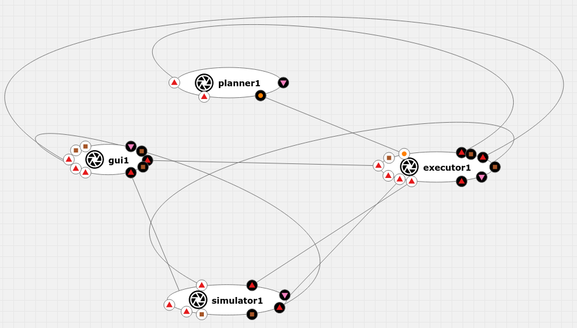

# AIPlan4EU Maze Planning, Execution and Simulation

This is an example of integrated planning, execution and simulation that can be
executed on the AI4EU experiments platform. A Graphical User Interface (GUI)
allows to assemble a simple maze with up to five agents, pushable obstacles, and
goal locations.  The GUI can send a state to the simulator (to overwrite the
simulators current state) and request the goals to be reached by the executor.

This example was originally created for AI4EU and has been extended to use the
[Unified Planning](https://github.com/aiplan4eu/unified-planning) framework
developed in the AIPlan4EU project.

Here is a simplified summary of the behavior/flow of each component.

GUI: 
1. Assemble a maze (with goal locations for agents)
2. Submit state to simulation
3. Request goal achievement
4. Wait for response from executor

The GUI also draws the internal state of the simulator when it receives a
message state message.

Executor: 
1. Wait for goal(s)
2. Assemble planning problem
3. Request plan from planner
4. Execute plan (if one was found)
5. Return success or failure to GUI

Simulator:
- Execute action (and update internal state accordingly)
- Send state updates (when internal state changes)

Planner:
- Solve planning problem and return solution or failure

If added and connected in the Acumos Design Studio on the AI4EU experiments
platform, the interaction between components will be orchestrated and the
resulting solution can be executed in a cluster.

Below we explain how to get this solution to run on a local Kubernetes cluster
via Minikube.

# Running via docker-compose

The full example can be run by using docker-compose and a hand-coded
orchestrator. For this we need to open one terminal for each component,
build, and start its docker container. Finally, we run the orchestrator.

Terminal 1:

    cd executor 
    docker-compose build
    docker-compose up
    
Terminal 2: 

    cd maze_gui 
    docker-compose build
    docker-compose up
    
Terminal 3: 

    cd simulator
    docker-compose build
    docker-compose up
  
Terminal 4 (use planner folder for alternative planner): 

    cd planner-up
    docker-compose build
    docker-compose up
    
Terminal 5:

Running this for the first time, we need to install some python grpc libraries (ideally in some virtual environment for python):

    cd orchestrator
    pip install -r requirements.txt
    
After this, the orchestrator can be run with:

    cd orchestrator
    python run.py

# Onboarding and Assembly in Acumos Design Studio

First, we need to make sure we have our components available in the Acumos
Design Studio. Each container must be tagged and pushed to a Docker repository
(such as *Docker Hub*).

## Build, Tag and Push Docker Containers

Here we use the repository host `cicd.ai4eu-dev.eu:7444`. First, we log in:

    docker login cicd.ai4eu-dev.eu:7444
    
Then we build, tag, and push four components.
    
    cd executor
    docker build -t executor .
    docker tag executor cicd.ai4eu-dev.eu:7444/tutorials/planning-and-execution:executor-v1
    docker push cicd.ai4eu-dev.eu:7444/tutorials/planning-and-execution:executor-v1
    
    cd ../maze_gui
    docker build -t maze-gui .
    docker tag maze-gui cicd.ai4eu-dev.eu:7444/tutorials/planning-and-execution:gui-v1
    docker push cicd.ai4eu-dev.eu:7444/tutorials/planning-and-execution:gui-v1
    
    cd ../simulator
    docker build -t simulator .
    docker tag simulator cicd.ai4eu-dev.eu:7444/tutorials/planning-and-execution:simulator-v1
    docker push cicd.ai4eu-dev.eu:7444/tutorials/planning-and-execution:simulator-v1
    
    cd ../planner
    docker build -t planner .
    docker tag planner cicd.ai4eu-dev.eu:7444/tutorials/planning-and-execution:planner-v1
    docker push cicd.ai4eu-dev.eu:7444/tutorials/planning-and-execution:planner-v1
    
    cd ../planner-up
    docker build -t planner-up .
    docker tag planner-up cicd.ai4eu-dev.eu:7444/tutorials/planning-and-execution:planner-up-v1
    docker push cicd.ai4eu-dev.eu:7444/tutorials/planning-and-execution:planner-up-v1

## Onboarding in Acumos

Onboarding in Acumos requires information about the containers we pushed above
and which protobuf interface each container offers. Below is the required
information for all four components. Between each component, make sure to reset
the onboarding form to avoid issues.

The following information is the same for all examples:

- Host: cicd.ai4eu-dev.eu
- Port: 7444
- Image: tutorials/planning-and-execution

These fields differ for each component:

- Name: executor
- Tag: executor-v1
- Protobuf: [executor.proto](./executor/executor.proto)

- Name: gui
- Tag: gui-v1
- Protobuf: [gui.proto](./maze_gui/gui.proto)

- Name: simulator
- Tag: simulator-v1
- Protobuf: [simulator.proto](./simulator/simulator.proto)

- Name: planner
- Tag: planner-v1
- Protobuf: [planner.proto](./planner/planner.proto)

- Name: planner-up
- Tag: planner-up-v1
- Protobuf: [planner.proto](./planner-up/planner-up.proto)

## Setting Model Categories

After a component has been onboarded, we need to assign a model category and
toolkit type. The steps below are a work-around because proper categories for
our components do not exist as of yet.

1. Navigate to *My Models* -> <NAME> -> *Manage my Model* -> *Publish to Marketplace* -> *Model Category*
2. Set *Model Category* to *Data Transformer*
3. Set *Toolkit Type* to  *Scikit-Learn*

## Connecting Components in the Acumos Design Studio

Next, we can assemble our solution in the Design Studio.

1. Navigate to *Design Studio* -> *Acu Compose*
2. Find your models under the model categories set previously
3. Drag and drop each model onto the canvas
4. Connect the ports of the components as required by the
   application. (Currently, a lot of interfaces have the same items because
   their messages are the same.) See image below for how it could look (ports
   may have different images and the arrangement may be different as well).
5. *Save* (top right)
6. *Validate* (top right)
7. *Deploy* -> *Deploy to Local* -> *Export to Local* -> *Download Solution
   Package*
   
We now have downloaded the solution in a file *solution.zip* that we can execute
on a Kubernetes cluster.

# Running the Solution

We can run the solution we downloaded from the platform with minikube.  This
section goes through the necessary steps.
  
## Install Minikube

Minikube allows to use a kubernetes cluster locally. Here we will use it to
execute the solution we just downloaded. The following installation instructions
and more information in Minikube can be found found
[here](https://minikube.sigs.k8s.io/docs/start/)

On linux:
  
    curl -LO https://storage.googleapis.com/minikube/releases/latest/minikube-linux-amd64
    sudo install minikube-linux-amd64 /usr/local/bin/minikube

    minikube start

    minikube kubectl -- get pods -A

## Install kubectl

Kubectl is a command line tool to control a kubernetes cluster (like minikube).
The following instructions and more information on kubectl can be found
[here](https://kubernetes.io/docs/tasks/tools/install-kubectl-linux/).

    curl -LO "https://dl.k8s.io/release/$(curl -L -s https://dl.k8s.io/release/stable.txt)/bin/linux/amd64/kubectl"
    curl -LO "https://dl.k8s.io/$(curl -L -s https://dl.k8s.io/release/stable.txt)/bin/linux/amd64/kubectl.sha256"
    echo "$(<kubectl.sha256) kubectl" | sha256sum --check

    sudo install -o root -g root -m 0755 kubectl /usr/local/bin/kubectl

## Run Solution

1. Download validated solution.zip from Acumos (export to local)
2. Extract solution and enter folder
3. Start minikube (only needed if not already started).

        minikube start
4. Create a namespace (only needed once) to run our solution.

        kubectl create namespace plan-and-exec

5. Run all nodes in the namespace.
  
        python kubernetes-client-script.py -n plan-and-exec

6. Take note of the IP and port mentioned at the end of the output. We will need
   it to start the orchestrator.
  
7. To see if things are working, get info on nodes, services, and pods running
   in our namespace.

        kubectl -n plan-and-exec get node,service,pod -o wide

   You should see one pod per node in AcuCompose plus one pod for the
   orchestrator. For each pod, there should be two services: one hosting gRPC
   and one hosting the web user interface. If all nodes are running, we are okay
   for now. It may take a moment for nodes to be up. If there are problems here,
   there may be a firewall in the way of minikube.

8. If all nodes are running, we can start the orchestrator with the IP and port
   we got above. If the IP and port were lost, we can retrieve them again with
   the following command:
  
        minikube -n plan-and-exec service --url orchestrator

9. To start the orchestrator:
  
        cd orchestrator_client
        python orchestrator_client.py <IP>:<PORT>

10. If everything is okay, the script will keep running and output nothing. If
    exceptions are thrown, it's likely that the orchestrator crashed. Here are
    some possible causes:
  
   - Using upper-case letters for components in AcuCompose may cause problems
   - Mismatch between .proto files on-borded to acumos and used by the code
      - It's okay to not use the exact same files (so, e.g., for java we can use
        *java_package* in protobuf but remove it in the on-boarded proto file.

11. Finally, to actually use the maze planner, we need to find the URL to access
    it in a browser.  This can be done by using the same command as for the
    orchestrator, but with a different service:

        minikube -n plan-and-exec service --url maze-gui1webui

   We can remove the `--url` part to directly open the GUI in a browser:

        minikube -n plan-and-exec service maze-gui1webui
